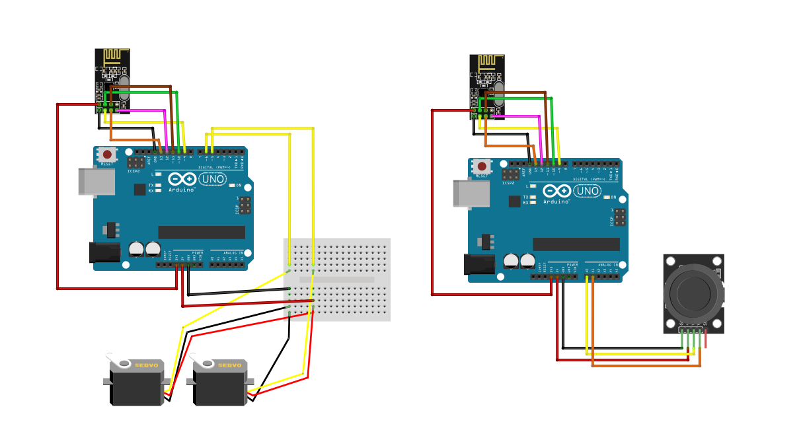

# Arduino Wireless Joystick Control

A wireless control project using two Arduino boards, nRF24L01 modules, and a joystick to control servos remotely. 

## Components
- 2 x Arduino Uno
- 2 x nRF24L01 wireless transceiver modules
- 1 x Joystick module
- 2 x Servo motors
- Breadboard and jumper wires

## Project Overview
The project consists of two main parts:
1. **Transmitter**: An Arduino connected to a joystick module and an nRF24L01 module. It reads joystick input and sends data wirelessly to the receiver.
2. **Receiver**: Another Arduino with an nRF24L01 module and two servos. It receives joystick data and controls the servos based on joystick movements.

## Wiring Diagram
Below is the wiring diagram for setting up both the transmitter and receiver:

## How It Works
1. The joystick module on the transmitter Arduino reads the user's input (X and Y axes).
2. The transmitter sends this data wirelessly through the nRF24L01 module.
3. The receiver Arduino receives the data and adjusts the servos accordingly, allowing for real-time, wireless control of servo movements.
